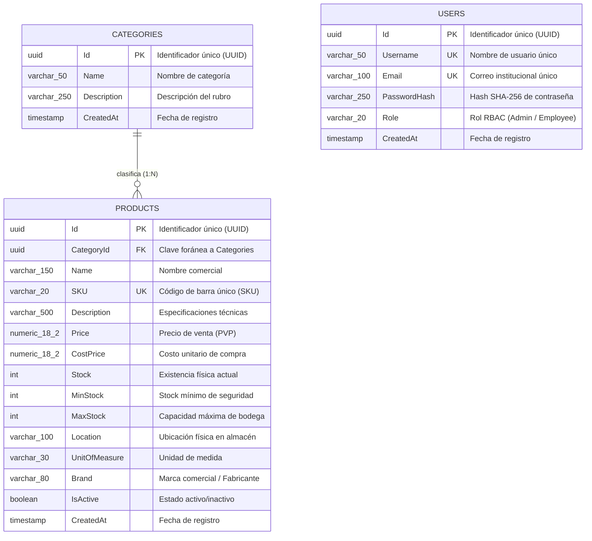

# Sistema de Gestión de Inventario Empresarial (ERP)

### **Asignatura: Desarrollo de Aplicaciones Web (Código: 0423807T)**

**Facilitador:** M.Sc. Ing. Gabriel Alexis Ramírez Sánchez  
**Email:** gramirezs@unet.edu.ve  
**Período Académico:** Septiembre, 2026  
**San Cristóbal, Estado Táchira, Venezuela**

---

## 📌 Descripción General

El presente proyecto constituye una solución integral de software empresarial orientada a la gestión de inventario, existencias, catalogación y control financiero para el sector comercial de ferretería, herramientas y materiales de construcción.

La arquitectura del sistema implementa estándares de desarrollo empresarial, aplicando **Onion Architecture** en el backend para lograr un desacoplamiento estricto entre el dominio del negocio y la infraestructura tecnológica, combinado con una aplicación de página única (**SPA**) reactiva construida en **React 18**, **Vite** y **Tailwind CSS**.

---

## 🏛️ Arquitectura del Sistema

El ecosistema se distribuye en una arquitectura por capas concéntricas (Onion Architecture) y un cliente desacoplado:

```
┌────────────────────────────────────────────────────────┐
│                   Frontend (SPA)                       │
│             React 18 + Vite + Tailwind CSS             │
└──────────────────────────┬─────────────────────────────┘
                           │ HTTP / JSON (REST API)
┌──────────────────────────▼─────────────────────────────┐
│                 Presentation.API                       │
│    Controladores REST, Middlewares RFC 7807, JWT Auth   │
├────────────────────────────────────────────────────────┤
│                 Core.Application                       │
│       Casos de Uso, DTOs, Validaciones (Fluent)        │
├────────────────────────────────────────────────────────┤
│                   Core.Domain                          │
│     Entidades del Dominio, Enums, Reglas de Negocio    │
├────────────────────────────────────────────────────────┤
│                 Infrastructure                         │
│       EF Core 10, Npgsql (PostgreSQL), Repositorios    │
└────────────────────────────────────────────────────────┘
```

### Componentes Clave:
1. **Core.Domain:** Contiene las entidades puras (`Product`, `Category`, `User`, `BaseEntity`) y enumeraciones (`UserRole`), sin dependencias de frameworks externos.
2. **Core.Application:** Implementa los contratos de servicios, DTOs de entrada/salida y validaciones declarativas con **FluentValidation**.
3. **Infrastructure:** Administra la persistencia con **Entity Framework Core 10**, configuración relacional vía **Fluent API**, siembra de datos (*data seeding*) y el patrón **Repository**.
4. **Presentation.API:** Expone los endpoints RESTful protegidos por **JWT Bearer**, autorización basada en roles (**RBAC**), política de **CORS** y captura global de excepciones estandarizada (**RFC 7807**).
5. **Frontend (SPA):** Interfaz moderna y responsiva con gestión de estado global (**Context API**), cliente HTTP centralizado, soporte para tema oscuro/institucional UNET, alternancia dinámica del imagotipo institucional y **Dashboard de Indicadores KPI** para analítica en tiempo real.

---

## 🎨 Sistema de Diseño, Modo Oscuro e Identidad Visual

La interfaz de usuario implementa la identidad visual oficial de la Universidad Nacional Experimental del Táchira (UNET) mediante una paleta cromática basada en el Azul Institucional (`#003366`) y soporte completo de **Modo Oscuro (*Dark Mode*)**:

- **Alternancia Dinámica de Logotipo:**
  - **Modo Claro (*Light Mode*):** Se proyecta el logo corporativo policromático sobre fondo blanco (`unet-logo.png`).
  - **Modo Oscuro (*Dark Mode*):** Se proyecta automáticamente el imagotipo blanco con canal alfa transparente (`unet-logo-dark.png`), preservando las dimensiones exactas y garantizando contraste óptimo contra fondos oscuros (`bg-slate-900` / `bg-unet-950`).
- **Persistencia de Tema:** El estado de preferencia de color se almacena en el almacenamiento local del navegador (`localStorage`) y se administra de forma reactiva mediante `ThemeContext`.

---

## ✨ Sistema de Animaciones y Micro-interacciones (Motion UI)

El frontend integra un catálogo de animaciones fluidas y elegantes configuradas en `tailwind.config.js`:

| Animación / Efecto | Utilidad CSS | Descripción Funcional |
| :--- | :--- | :--- |
| **Orbes Ambientales Flotantes** | `animate-float-slow`, `animate-float-reverse`, `animate-float-delayed` | Esferas difuminadas en tonos cian, azul UNET e índigo que se desplazan armónicamente en el fondo del Login. |
| **Entrada Suave de Tarjetas** | `animate-fade-in-up` | Aparición vertical con interpolación de opacidad y escala para formularios y contenedores principales. |
| **Apertura Elástica de Modales** | `animate-pop-in` | Transición de escala (`0.95` a `1.0`) y difuminado de fondo (*backdrop blur*) al abrir ventanas modales. |
| **Destello en Botones de Acción** | `shimmer` | Barrido de luz diagonal animado que recorre los botones principales al interactuar con ellos. |
| **Resplandor y Pulsación de Alertas** | `pulse-glow`, `animate-pulse` | Señalización visual sutil en indicadores críticos y productos con quiebre de stock. |
| **Elevación Tridimensional en KPIs** | `hover:-translate-y-1.5 hover:shadow-xl` | Respuesta táctil al cursor con elevación y expansión de sombra en tarjetas estadísticas. |
| **Transición Cruzada entre Vistas** | `animate-fade-in` | Desvanecimiento fluido al conmutar entre las pestañas de *Dashboard* y *Catálogo*. |

---

## 🗄️ Modelo Entidad-Relación (Base de Datos PostgreSQL)

El esquema relacional mapeado a través de **Entity Framework Core 10 (Code-First + Fluent API)** se estructura de la siguiente manera:



---

## 🚀 Tecnologías Empleadas

- **Backend:** .NET 10 (C# 14), ASP.NET Core Web API.
- **ORM & Base de Datos:** Entity Framework Core 10, Npgsql, PostgreSQL 15+.
- **Seguridad:** JSON Web Tokens (JWT) con algoritmo HMAC-SHA256, Hashing SHA-256 de contraseñas.
- **Frontend:** React, Vite, Tailwind CSS, Lucide React Icons.
- **Contenerización & DevOps:** Docker, Docker Compose (Multi-stage builds), Nginx Alpine.

---

## 🛠️ Requisitos Previos

Para ejecutar la aplicación en un entorno de desarrollo local se requiere:

- [Docker Desktop](https://www.docker.com/products/docker-desktop/) (recomendado para despliegue unificado)
- [SDK de .NET 10](https://dotnet.microsoft.com/download) (para ejecución local del backend)
- [Node.js 20 LTS](https://nodejs.org/) (para ejecución local del frontend)
- [PostgreSQL 15+](https://www.postgresql.org/) (en caso de no utilizar Docker)

---

## 📦 Puesta en Marcha con Docker Compose

La forma más rápida de inicializar todo el stack (Base de Datos + API + Frontend) es mediante Docker Compose:

```bash
# 1. Clonar el repositorio
git clone <URL_DEL_REPOSITORIO>
cd desarrolloAplicacionesWeb

# 2. Compilar e inicializar los tres contenedores en segundo plano
docker compose up --build -d

# 3. Verificar el estado de los contenedores
docker compose ps
```

### Puntos de Acceso del Sistema:
- **Frontend SPA:** [http://localhost:8080](http://localhost:8080) (vía Nginx) o [http://localhost:5173](http://localhost:5173) (vía Vite Dev)
- **Backend API REST:** [http://localhost:5000/api](http://localhost:5000/api)
- **Base de Datos PostgreSQL:** `localhost:5432` (`inventory_db`)

---

## 👤 Credenciales Preconfiguradas (Datos de Siembra)

El sistema incluye una siembra inicial de usuarios para pruebas de autorización RBAC:

| Rol | Usuario | Contraseña | Permisos |
| :--- | :--- | :--- | :--- |
| **Administrador** | `admin` | `admin123` | Acceso total: CRUD productos, categorías, analítica KPI y control de catálogo. |
| **Empleado** | `empleado` | `empleado123` | Consulta y actualización de inventario, sin permisos de eliminación ni gestión de categorías. |

---

## 🧪 Pruebas Unitarias Automatizadas (Testing Suite)

El proyecto cuenta con una batería integral de pruebas unitarias automatizadas que garantiza la confiabilidad, estabilidad y correcto cumplimiento de las reglas de negocio en la capa de aplicación (`Core.Application`), sin depender de infraestructura externa o bases de datos físicas.

### 🧰 Ecosistema y Herramientas de Testing:
- **xUnit.net v2.8:** Framework estándar para la definición, estructuración y ejecución paralela de casos de prueba (`[Fact]` y `[Theory]`).
- **Moq v4.20:** Librería para la creación de dobles de prueba (*mocks*) sobre las interfaces de repositorios (`IRepository<T>`, `IProductRepository`, `ITokenService`), permitiendo aislar completamente la lógica de negocio.
- **FluentAssertions v6.12:** Biblioteca de aserciones expresivas y legibles que facilita la verificación de estados, colecciones y excepciones esperadas.
- **FluentValidation v11.9:** Motor de validación declarativa testeado rigurosamente ante datos límite y entradas anómalas.

---

### 📋 Módulos y Cobertura de Pruebas:

| Componente Bajo Prueba (SUT) | Archivo de Prueba | Casos Cubiertos | Reglas de Negocio Validadas |
| :--- | :--- | :---: | :--- |
| **`ProductService`** | `ProductServiceTests.cs` | 8 | • Mapeo bidireccional DTO / Entidad.<br>• Unicidad obligatoria del código SKU.<br>• Validación de existencia de categoría asociada.<br>• Persistencia y aislamiento de dependencias. |
| **`CategoryService`** | `CategoryServiceTests.cs` | 4 | • Conteo dinámico de productos por categoría.<br>• Normalización y saneamiento de cadenas (*Trim*).<br>• Bloqueo de eliminación cuando existen productos asociados (Integridad referencial). |
| **`UserService`** | `UserServiceTests.cs` | 3 | • Autenticación exitosa con credenciales válidas y generación de JWT.<br>• Rechazo de contraseña inválida mediante hash criptográfico SHA-256.<br>• Manejo de usuario inexistente retornando `null`. |
| **`CreateProductValidator`** | `CreateProductValidatorTests.cs` | 14 | • Longitud de nombre (3 a 150 caracteres).<br>• Formato alfanumérico estricto del SKU (`^[A-Z0-9\-]{3,20}$`).<br>• Precio de venta estrictamente mayor a 0.<br>• Coherencia de inventario (`MaxStock > MinStock`). |
| **`CreateCategoryValidator`** | `CreateCategoryValidatorTests.cs` | 4 | • Obligatoriedad y límites de caracteres en el nombre (2 a 80).<br>• Límite máximo de descripción (250 caracteres). |

**Total de Pruebas Automatizadas:** 31 pruebas unitarias ejecutadas con 100% de tasa de éxito.

---

### ⚙️ Procedimiento de Ejecución de Pruebas:

#### Opción A: Ejecución mediante Docker (No requiere .NET instalado en la máquina anfitriona)
```bash
docker run --rm -v "${PWD}:/app" -w /app mcr.microsoft.com/dotnet/sdk:10.0 dotnet test tests/Core.Application.Tests/Core.Application.Tests.csproj --verbosity normal
```

#### Opción B: Ejecución local con .NET SDK
```bash
# Desde la raíz del repositorio
dotnet test tests/Core.Application.Tests/Core.Application.Tests.csproj
```

---

## 📂 Estructura del Repositorio

```
desarrolloAplicacionesWeb/
├── .github/
│   └── workflows/
│       └── ci-cd.yml          # Pipeline de Integración Continua (GitHub Actions)
├── src/
│   ├── backend/
│   │   ├── InventorySystem.sln # Solución principal de .NET
│   │   ├── Core.Domain/       # Entidades puras y enums del negocio
│   │   ├── Core.Application/  # DTOs, interfaces de servicio y validadores
│   │   ├── Infrastructure/    # DbContext, Fluent API y repositorios EF Core
│   │   └── Presentation.API/  # Controladores REST, Middlewares y Dockerfile
│   └── frontend/
│       ├── public/            # Recursos estáticos e isotipos institucionales
│       ├── src/               # Componentes React, contextos y cliente HTTP
│       ├── Dockerfile         # Construcción multi-stage con Nginx
│       └── nginx.conf         # Configuración del servidor web de producción
├── tests/
│   └── Core.Application.Tests/ # Suite de pruebas unitarias xUnit + Moq
│       ├── Services/          # Pruebas de lógica de negocio y servicios
│       └── Validations/       # Pruebas de reglas declarativas FluentValidation
├── docker-compose.yml         # Orquestación multicontenedor local
├── DEPLOYMENT.md              # Guía de despliegue en la nube (Fly.io / Render)
├── .gitignore                 # Exclusiones de Git para .NET, Node y Docker
└── README.md                  # Documentación principal del proyecto
```

---

## ☁️ Despliegue en Producción

Para consultar los procedimientos de compilación de imágenes de contenedor, publicación en Docker Hub y despliegue en servicios en la nube (como Fly.io o Render), revise el documento [DEPLOYMENT.md](DEPLOYMENT.md).
